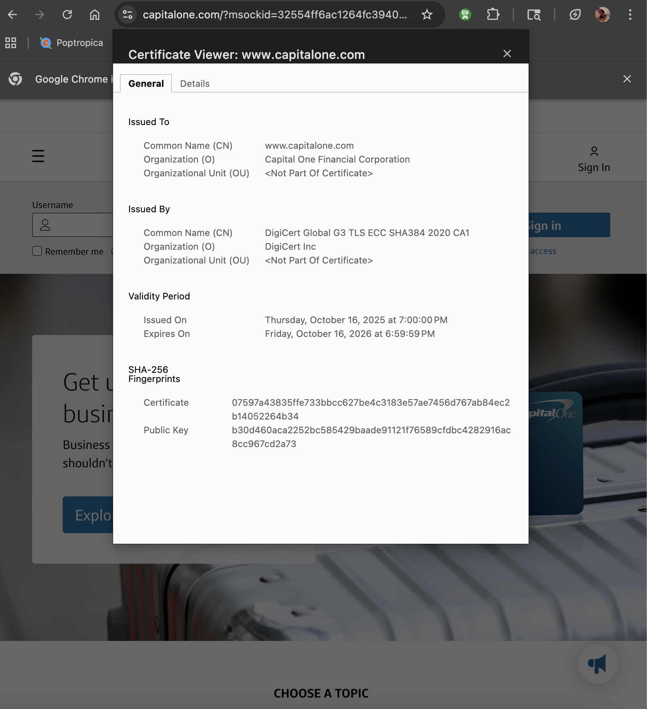

# Week 01 Lab — Certificate Inspection

## Screenshot Evidence

1. Capture a screenshot of the certificate details in your browser.
2. Save it as:

assets/screenshots/week-01/certificate-inspection.png

3. Embed the screenshot below:

## Website Information

**Website inspected:**  
https://www.capitalone.com/?msockid=32554ff6ac1264fc39405a60ad9965be

**Issuer (Certificate Authority):**  
 DigiCert Global G3 TLS ECC SHA384 2020 CA1

**Valid from:**  
Thursday, October 16, 2025 at 7:00:00 PM

**Valid until:**  
Friday, October 16, 2026 at 6:59:59 PM

If certifcate is expired it will not work anymore untill renewed

**Signature algorithm:**  
X9.62 ECDSA Signature with SHA-384

---

## Subject Alternative Names (SAN Entries)

List at least 2–3 SAN entries:

-  www.capitalone.com
-  capitalone.com
- 

---

## Observations

Document three observations about the certificate.

### Observation 1

I can see the Certificate Hierarchy under the Details Tab and it shows:
DigiCert Global Root G3 - as the Root CA (Trusted Authority)
DigiCert Global G3 TLS ECC SHA384 2020 CA1 - as the Intermediate CA (Issuing Authority)
www.capitalone.com - is the website SSL Certificate (yourdomain.com)
and this would be considered the Certificate Trust Chain

### Observation 2

When actually clicking on the subject www.capitalone.com 
going down the certificate field and selecting Subject then Subject's Public Key i was able to find the public key that is bound to this certificate 

### Observation 3

For the Issued to and Issued by columns both show that Organizational Units are Not Part Of Certificate

---

## Reflection

Based on your inspection, explain how this certificate contributes to secure HTTPS communication.

This certificate contributes to secure HTTPS communication by proving the identity of the website, which The ceritificate authority had verified does belong to Capital One. A public key was also bound to the subjects identity, and that trust comes from the issuer which the system also verifies through the trust chain working its way up to the Root CA validating it. 

