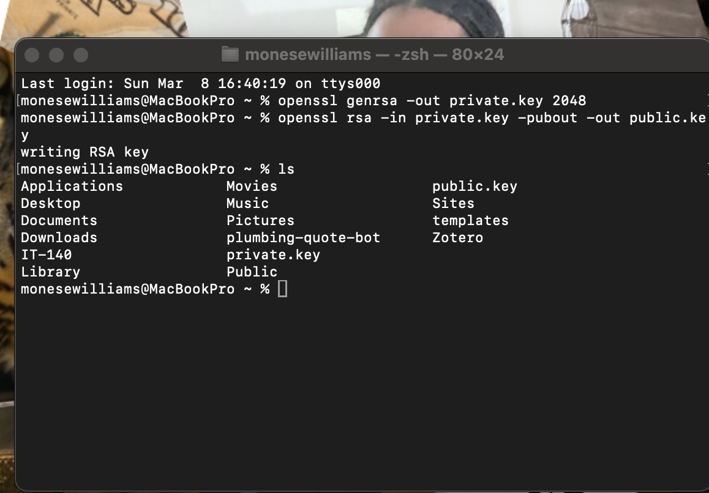

# Week 01 Lab — Key Pair Generation

## Screenshot Evidence

If using OpenSSL:
1. Capture a screenshot showing:
  - The command used to generate the private key
  - The command used to extract the public key
2. Save it as:

**assets/screenshots/week-01/keypair-generation.png**

3. Embed the screenshot below:

****

If using a browser-based generator, capture the generated key pair screen (redact sensitive portions of the private key before committing).

---

## Key Identification
**Which file is the public key?**
Applicatons > Movies

**Which file is the private key?**
IT-140

---

## Key Properties
Briefly describe:
- What makes the public key safe to share?

   The Public Key is safe to share because its bind with the certificate, it helps verify the digital signatures and encrypts data
  
- What makes the private key sensitive?

The Private key is senstitve beacuse it creates the digital signture of the certifcate and it proves the control of the identity, it also can be used decrypts data that someone sends to the public key

---

## Security Scenario
What would happen if someone obtained your private key?

If someone obtained my private key they would be able to take control of the identity, and impersonating me the owner of the system. the attacker who also obtained my private key would then also be able to digital sign and decrypt messages of privtae data. Trust would then be officak broken through the system and the certficate since the identity is no longer being controlled by the correct person

Explain the risk in terms of:
  - Identity
  - Impersonation
  - Trust

---

## Observations
Document three observations from this lab.

### Observation 1
 I've noticed i had to use openssl to generate the private key first then used the given command to have the private key generate the publick key 

### Observation 2
 I noticed the key size is 2048 which is a very large size which could enhance the security of the key making it harder to break and/or figure out

### Observation 3
first thing i've noticed is that both keys are in two different files in my system. the keys also differ with the public key being able to be shared while the private key must be kept a secret 

---

## Reflection
In 3–5 sentences, explain:

Why must the private key remain secret in a PKI system?

Focus on how identity is tied to possession of the private key.

The private key must remain secret in a PKI system because the private key proves the control of an identity, decrypts data and creates the digtal signature within the certificate. If someone was to access this secret key all trust in regards to the identity will be broken. if trust is broken there would be no verifiable identity with the system. 
