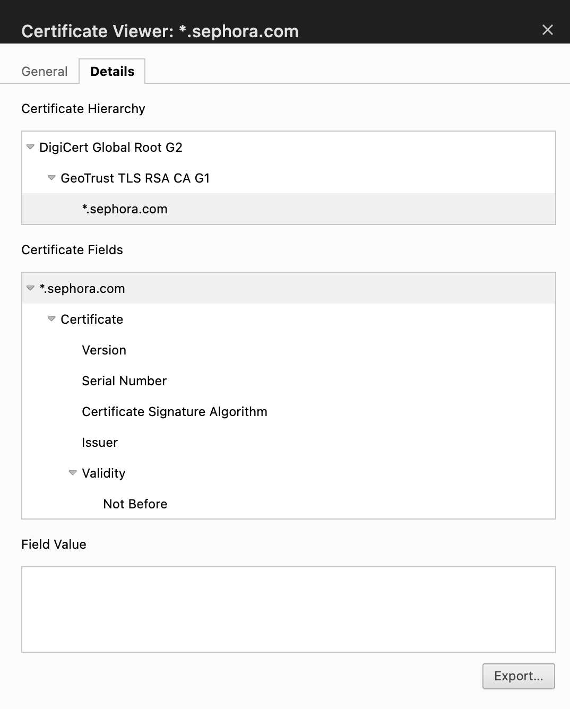

# Week 01 Mini Lab — Trust Chain Validation

## Screenshot Evidence

Capture a screenshot of the Certification Path (certificate chain) from your browser.

Save it as:

assets/screenshots/week-01/trust-chain-validation.png

Embed the screenshot below:

## Website Information

**Website inspected:**  
https://www.sephora.com/?om_mmc=ppc-MSN_26492197_1895236143_kwd-24879543826:loc-190_84189_c&country_switch=us&lang=en&gclid=d12bb6297fe21bae6de0df83153128a1&gclsrc=3p.ds&ds_rl=1261807&msclkid=d12bb6297fe21bae6de0df83153128a1&utm_source=bing&utm_medium=cpc&utm_campaign=Sephora-USA-USD_X_TM_CONV_X_M-TAD_DESK_Exact_X_X_EN_Anchor&utm_term=sephora&utm_content=TAD_X_X_X_X_Anchor

---

## Certificate Chain Breakdown

**Leaf (Server) Certificate**  
*.sephora.com

**Intermediate Certificate Authority**
GeoTrust TLS RSA CA G1

**Root Certificate Authority (Trust Anchor)**
DigiCert Global Root G2

---

## Trust Anchor Verification

Is the Root CA marked as trusted by your system?

Yes

If yes, explain where that trust comes from (OS/browser root store).

The Root CA is trusted becausebit is in my macOS Trusted store. During my research i was able to navigate to macOS trusted store by opening keychain access, clicking on system roots, then typing in the full name of the Root CA. The Root CA populated during the search verifying that the Root CA is trusted by my system

If no, explain what warning or behavior occurred.

---

## Observations

Document three observations about the certificate.

### Observation 1

I noticed within the Chain Structure that the Root CA ( DigiCert Global Root G2) is at the the top, which is the one who signs and issues certifiactions to the Intermediate CA, below it is theN THE Intermediate CA (GeoTrust TLS RSA CA G1), which is the one who signs and issues certificate to the End Entity and on the bottom is the End Entity ( *.sephora.com) which is the one who receives the certificate that was digitally signed by the Intermediate CA

### Observation 2

I noticed the Root CA is at the top of the Certificate Chain. The Root CA (DigiCert Global Root G2) is also the issuer of the certificate issued to the intermediate CA (GeoTrust TLS RSA CA G1)

### Observation 3

I noticed the browser detemines trust by validating the Certification Chain starting from the End Enity and verifying the certifactes that was Issued and Digital signatures by the intermediate CA, then the system veirfies the certification that was issued to the Intermediate Ca by the Root CA and their Digital Signature. After verifying the digital signatures on the certificates the browser then checks the vault and/or trusted store for the Root CA. 

---

## Reflection

In 3–5 sentences, explain:
- Why the Root certificate is called a trust anchor
- How validation walks the certificate chain
- What would happen if the Root CA were not trusted

Use your own words.

The Root certificate is called the trust anchor because the Root CA is in the trusted store within the system which helps hold the entire chain together. this allows the system to validate the certificates issued below it. Validation walks the certificate chain by starting from the end entity and working its way up to the Root CA. if the Root Ca was not trusted within the validation process the chain will then become broken

Stretch (Optional)

- The second HTTPS site i chose to inspeact is Youtube.com
https://www.youtube.com/

-The Root Ca is Different from Capital One, Youtube Root Ca is named GTS Root 4

-The Intermediate is different and named WE2

- This tells me that certificates can be issued from diffrent Root and Intermeditae CA for different sites 

